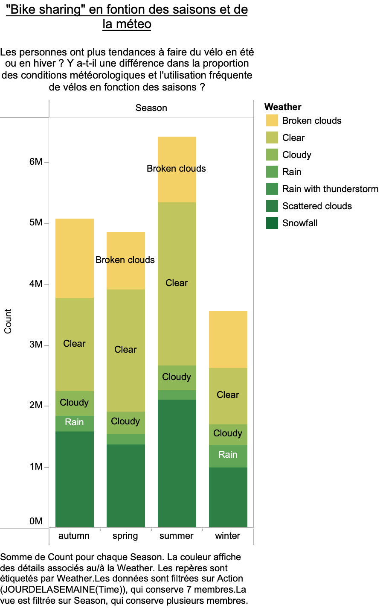
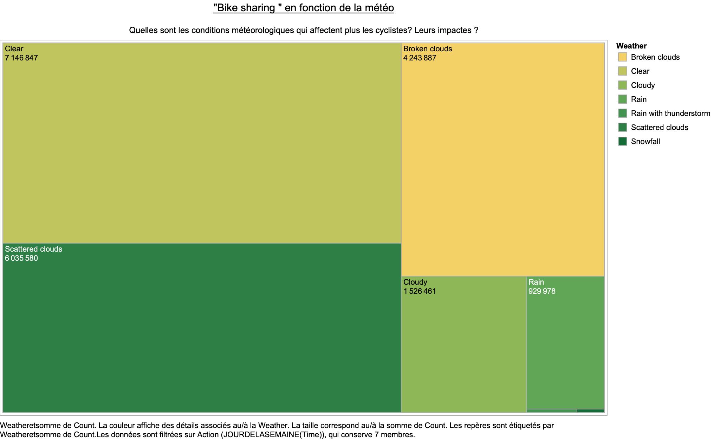

# London-Bike-Sharing

## Introduction
Le partage de vélos est devenu un mode de transport populaire dans de nombreuses villes, offrant une alternative pratique et écologique. Dans ce projet de visualisation des données, nous nous concentrerons sur le jeu de données "London Bike Sharing", qui fournit des informations sur l'utilisation des vélos en libre-service à Londres. Ce jeu de données comprend des détails sur les stations de vélo, les horodatages des départs et des retours de vélos, ainsi que des données météorologiques associées.

## Les Objectifs:

Explorer les tendances et les schémas d'utilisation des vélos en libre-service à Londres en utilisant des techniques de visualisation efficaces. En combinant les aspects temporels, et météorologiques des données, nous espérons obtenir une vision approfondie de l'utilisation des vélos dans la ville.

## 
Les périodes de l'année ou le partage de vélo se font plus fréquemment:

On remarque que les moments ou l'utilisation de vélo se font le plus fréquemment se trouvent en période estivale. Tandis que les moments ou l'utilisation de vélo se font le moins fréquemment se trouvent en période hivernale. 

Ce graphique le prouve d'autant plus :

On remarque alors que les conditions météorologiques ont un réel impact sur l’utilisation des vélos dans la ville de Londres. En effet, les utilisateurs de vélos auront plus tendance à en faire lorsque le temps est "Clear", donc dégagé que quand la météo laisse percevoir de la pluie "Rain". 

Argument prouvé par le graphique suivant: 

##
En conclusion, ce projet de visualisation des données sur le jeu de données "London Bike Sharing" nous a permis de découvrir des insights précieux sur l'utilisation des vélos en libre-service à Londres. Les visualisations ont révélé des schémas d'utilisation, des tendances saisonnières et des facteurs météorologiques qui influencent la demande de vélos. Ces informations peuvent être utilisées pour optimiser les ressources et promouvoir une mobilité urbaine durable. Cependant, des analyses plus approfondies et l'intégration de données supplémentaires seraient nécessaires pour obtenir une vue plus complète de l'utilisation des vélos en libre-service à Londres et pour faciliter la prise de décisions éclairées dans ce domaine.

## Sources des données: 

Https://cycling.data.tfl.gov.uk/ 

freemeteo.com - weather data

https://www.gov.uk/bank-holidays
From 1/1/2015 to 31/12/2016

