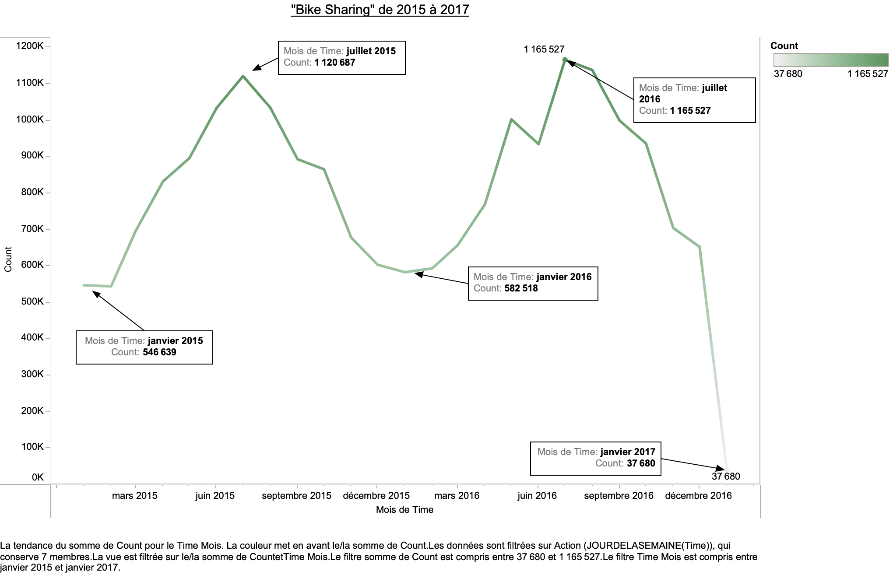

# London-Bike-Sharing
Data Visualisation 

Le partage de vélos est devenu un mode de transport populaire dans de nombreuses villes, offrant une alternative pratique et écologique. Dans ce projet de visualisation des données, nous nous concentrerons sur le jeu de données "London Bike Sharing", qui fournit des informations sur l'utilisation des vélos en libre-service à Londres. Ce jeu de données comprend des détails sur les stations de vélo, les horodatages des départs et des retours de vélos, ainsi que des données météorologiques associées.

Les Objectifs:

Explorer les tendances et les schémas d'utilisation des vélos en libre-service à Londres en utilisant des techniques de visualisation efficaces. En combinant les aspects temporels, et météorologiques des données, nous espérons obtenir une vision approfondie de l'utilisation des vélos dans la ville.

Les périodes de l'année ou le partage de vélo se fait plus fréquemment:

On remarque que les moments ou l'utilisation de vélo se fait le plus frequemment se trouvent en période estivale. Tandis que les moments ou l'utilisation de vélo se fait le moins fréquemment se trouvent en période hivernale. 

